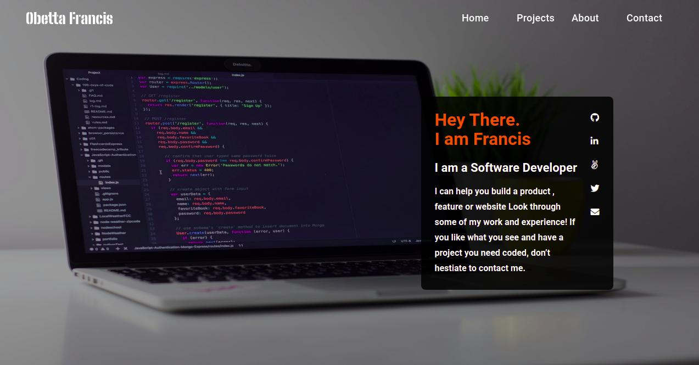

# Chasscept

> My Personal Portfolio



## Built With

- JavaScript
- HTML
- SCSS
- Webpack

## Live Demo

[chasscept.netlify.app/](https://chasscept.netlify.app/)

## Instructions

```bash

  # Clone the project from it's github repo.

  $ git clone https://github.com/chasscepts/chasscept

  # Change directory to the root of project

  $ cd chasscept

  # Install all dependencies

  $ npm install

  # Start webpack-dev-server (This will open the page in your browser)

  $ npm run serve

  # Run Tests

  $ npm run test

  # To build the project for production

  $ npm run build

```

## Authors

👤 **Obetta Francis**

[](https://github.com/chasscepts) [](https://twitter.com/chasscepts) [](https://www.linkedin.com/in/chasscepts/)

## 🤝 Contributing

Contributions, issues, and feature requests are welcome!

Feel free to check the [issues page](https://github.com/chasscepts/chasscept/issues).

## Show your support

Give a ⭐️ if you like this project!

## Acknowledgments

- computer-1.jpg by [Clément Hélardot](https://unsplash.com/@clemhlrdt?utm_source=unsplash&utm_medium=referral&utm_content=creditCopyText) on [Unsplash](https://unsplash.com/s/photos/computer?utm_source=unsplash&utm_medium=referral&utm_content=creditCopyText)

- Microverse Community
- Everyone whose code was used in this project

## 📝 License

This project is [MIT licensed](./LICENSE)
